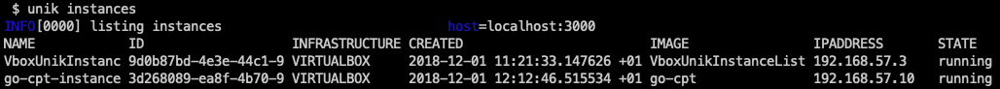
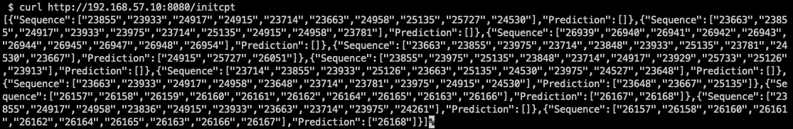

# go-cpt

A Go implementation of Compact Prediction Tree. A blog post related is [available](http://made2591.github.io/blog/compact-prediction-tree)

## Instructions

To install:

```
git clone https://github.com/made2591/go-cpt
cd go-cpt
go run main.go
```

## Build UniK image

Assuming you already installed UniK correctly, then with a daemon running in a terminal open another shell and run:

```
unik build --name go-cpt-image --path ./ --base rump --language go --provider virtualbox --force
unik run --instanceName go-cpt-instance --imageName go-cpt-image
```

To retrieve the running instances:
```
unik instances
```
You can see IP assigned to instances in the last column of the output



To see the logs of the running instances run:
```
unik logs --instance go-cpt-instance
```

What this image does is actually expose the different endpoint to initialize training and make prediction by rest api - ```it's only a draft```:

A sample file are already uploaded into the upload folder: you can modify the ```main.go``` root of the project to avoid cutting the training and testing set. Otherwise, to see the run you can both execute the code locally or
```
curl http://<YOUR_RUNNING_INSTANCES>:8080/initcpt
```

You should see predictions for the first 10 sequences :-)


## Author

* **Matteo Madeddu** - *[here](https://made2591.github.io) is my github personal page* -

## Credits

- [UniK contributors](https://github.com/solo-io/unik/graphs/contributors)
- [NeerajSarwan](https://github.com/NeerajSarwan)
